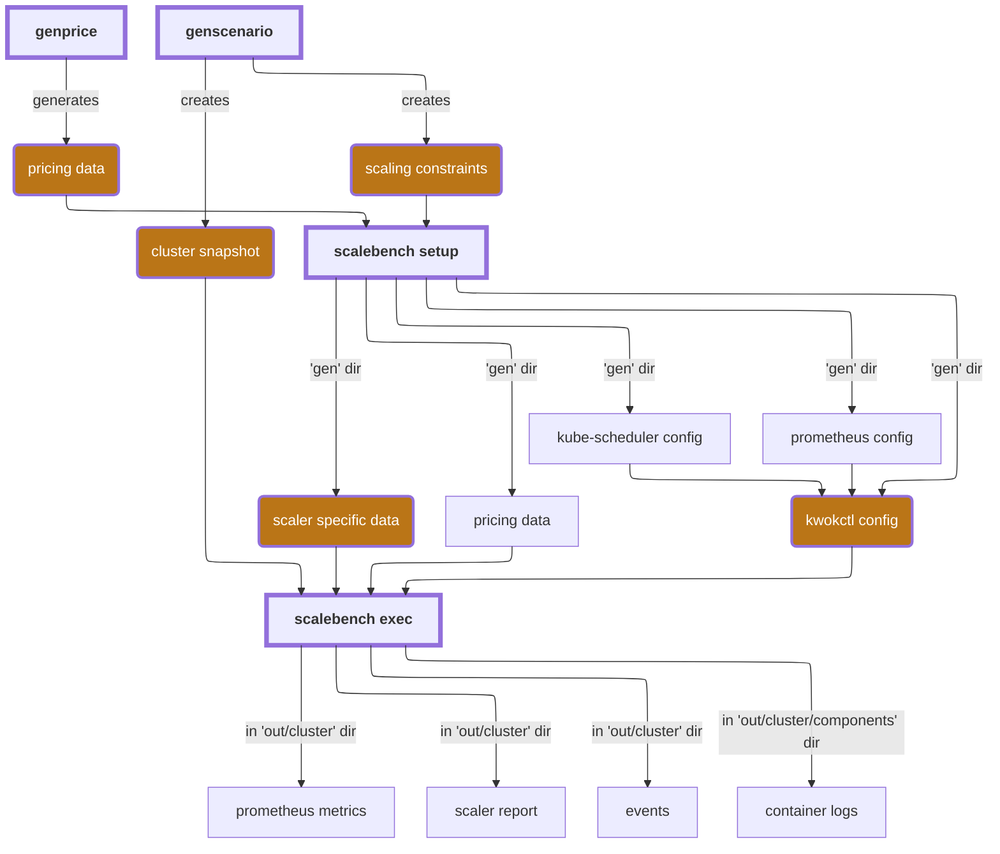

## Design

`scalebench` leverages [e2e-framework](https://github.com/kubernetes-sigs/e2e-framework/tree/main) to construct the environment needed for running the benchmarking harness, this means running the control plane components:
1. kube-scheduler
2. kube-apiserver
3. etcd

In addition to the above, the scaler for which benchmarking needs to be done is also deployed alongwith the kwok-controller for managing the fake nodes. It uses kwokctl's "docker" runtime (that uses `docker-compose` under the hood) which leads to each component getting their own container making monitoring and management of the components easy.

All the workload is deployed by the `exec` command after all the required components are up and then the deployed scaler can trigger node scaling depending on the pending, unscheduled pods. The required information is captured as part of `ClusterSnapshot`.

The templates for the new nodes that are spun up is provided as `kwok` provider specific data for the respective scaler.

For cluster autoscaler, this includes two configmaps:
1. `kwok-provider-templates`: consists of node templates used to create new nodes. To learn more about the provider, check the [upstream documentation](https://github.com/kubernetes/autoscaler/tree/master/cluster-autoscaler/cloudprovider/kwok).
2. `kwok-provider-config`: specifies how to get the nodegroup data for the kwok cloudprovider implementation. Relies on construction of nodegroups using the `worker.gardener.cloud/pool` label on the template nodes specified in `kwok-provider-templates`.

For karpenter, it needs:
1. `instance_types.json`: a master list consisting of all available offerings which can be used by karpenter as candidates when constructing nodes ([example](https://github.com/kubernetes-sigs/karpenter/blob/main/kwok/examples/instance_types.json))
2. `NodePool`s: this is used to set constraints on the nodes that can be created by and the pods that can run on those nodes. ([upstream documentation](https://karpenter.sh/docs/concepts/nodepools/))
3. `KWOKNodeClass`es: these are just dummy NodeClasses needed by the kwok provider implementation (for actual cloudproviders, these contain provider specific settings)
To learn more, check the [upstream documentation](https://github.com/kubernetes-sigs/karpenter/tree/main/kwok).

All this required data is generated using the `ScalingConstraints` file which is passed to the `setup` subcommand alongwith the scaler and the required version of the scaler used to build the docker image.

### Alternatives considered

During the development phase, alternative approaches for constructing the environment needed to run the harness were considered, these included:
1. `envtest`: this tool is used by [controller-runtime](https://github.com/kubernetes-sigs/controller-runtime/tree/main/tools/setup-envtest) for fetching the control plane binaries, however this doesn't include kube-scheduler and doesn't support docker; only allows for running the components as local processes thereby making management and cleanup a chore.
2. `kind` runtime: this runtime provided by "kwokctl" allows one to leverage kind in order to deploy control plane components on a `Node`, however this is more resource intensive. Also the distinction between the kind control plane node and the worker nodes require tweaking the affinities/selectors of the workload to ensure that its not deployed on non-kwok nodes.

The advantages of leveraging `e2e-framework` and `kwokctl` lies in the fact that it gives one a golang-native way of managing the entire harness lifecycle rather than relying on bash scripts which don't do proper error handling. It also allows for automated log collection rather than relying on a different service or managing it yourself.

## Usage

To run the the basic snapshot test:
1. Go to the `bench` directory.
2. Build scalebench: `make build`
3. Ensure docker is running.
4. Run the setup command (generates the kwok-provider data for the scaler and builds the scaler image). To get the pricing data for `setup`, `scadctl genprice` needs to be run. For running the basic scenarios, the provided [m5lpricing.json](./cmd/scenarios/m5lpricing.json) can be used.
```
bin/scalebench setup cluster-autoscaler -c "./cmd/scenarios/basic-scaleout/cluster-constraints.json" -p "./cmd/scenarios/m5lpricing.json"
```

5. Run `scalebench` with the snapshot. You can set `export KUBECONFIG=~/.kube/config` to target the kwok cluster for inspecting. 
```
bin/scalebench exec cluster-autoscaler --snap "cmd/scenarios/basic-scaleout/cluster-snapshot.json"
```

Available flags for `exec`:
| Flag | Short | Default | Description |
|------|-------|---------|-------------|
| `--snap` | | (required) | Path to the cluster snapshot file |
| `--config` | `-c` | embedded | Path to the custom kwokctl config file |
| `--scaler-version` | `-v` | `main` | Version of the scaler to fetch |
| `--skip-cleanup` | `-s` | `false` | Skip deleting cluster upon finishing |
| `--wait-for-cancel` | `-w` | `false` | Wait for cancel signal after scaling completes before writing report |

While the `exec` subcommand cleans up the kwok cluster on a `SIGINT` signal, if that somehow fails then to manually stop the kwok cluster run:
```
kwokctl delete cluster --name=<cluster-name>
# or to remove all clusters
kwokctl delete cluster --all
```

## Flow



## Report and Metrics Collection

During the harness execution, the CPU and Memory usages for the various containers are queried for using the docker socket and converted to relevant prometheus metrics for monitoring. Alongwith that an additional target is also added for prometheus to scrape for, which is the scaler-specific prometheus endpoint. Thus all the metrics related to the harness execution and scaler activity can be observed at a single point.

There's one additional thing of note with regards to metrics, that being that the prometheus database store is also mounted to the same path as the harness `exec` output directory. This allows for all the metrics data to be captured as an artifact which can then be later observed (by running a prometheus instance pointing to the stored data) even after the harness finishes running. The data for the container metrics is scraped every second.

To run a prometheus instance locally, in order to observe the stored metrics data, just point to the output directory for the scenario which was executed.
```
prometheus --storage.tsdb.path=$PWD/cmd/scenarios/basic-scaleout/out/{cluster_name} --config.file=/dev/null --web.listen-address=:9090
```

In order to consume the `tsdb` formatted data in a human-readable plaintext form, prometheus provides a tool `promtool` which can be used to convert the data.
```
promtool tsdb dump ./cmd/scenarios/basic-scaleout/out/{cluster_name}
```

The harness also generates two additional files on finishing the execution, those are `scaler-report.json` detailing out the scaling operations and scheduling timelines (alongwith a brief summary of various events and a before/after cluster state) and `scaler-events.json` that holds a timeline of various events of interest (pod preemption, node creation/deletion, scaling and scheduling events etc) which were emitted during the harness execution.

The harness also saves the logs from various components that it runs in the `out/{cluster}/components` directory of the scenario which was run.

### Alternative considered

Rather than using a homebrew solution for collecting container metrics, using [cadvisor](https://github.com/google/cadvisor) was also considered, however it needs to run as a privileged docker container to access the docker socket for macOS and running it outside the harness (not as part of the kwokctl compose project) negated the gains it would've provided.


## Validation

The harness setup and scaling execution was verified by testing it under a standard set of scenarios:
1. [basic-scaleout](./cmd/scenarios/basic-scaleout/): This scenario has a bunch of unscheduled pods and no existing nodes, the expectation is for the scaler to spin up a bunch of nodes for the pending workload.
2. [scalein](./cmd/scenarios/scalein/): This scenario has a bunch of scheduled pods and a few existing nodes which are underutilised, the pods can be properly packed if rescheduled onto existing nodes allowing for some nodes to become empty and get scaled in.
   NOTE: Because CA defaults for scale-down are conservative, this scenario also has an additional configuration provided which can be passed to the exec command `-c ./cmd/scenarios/scalein/aggressive-kwok-ca.yaml` to allow for rapid scale-down observations.
3. [preemption](./cmd/scenarios/preemption/): This scenario has a bunch of scheduled pods belonging to a lower priority class and a couple unscheduled pods with higher priority. The expectation is for the scheduler to preempt the lower-priority pods, scheduling the higher priority pods in their place and the scaler to then bring up more nodes to allow the evicted pods to be scheduled
4. [unschedulable](./cmd/scenarios/unschedulable/): This scenario has a bunch of unscheduled pods and no existing nodes, for the specified constraints no node can be scaled up that satisfies these pods' resource requirements hence the scaler should emit events stating it cannot perform any scaling activity for the pods.
